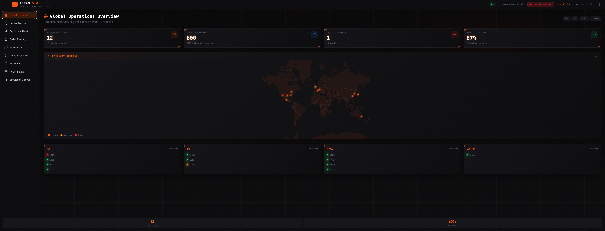
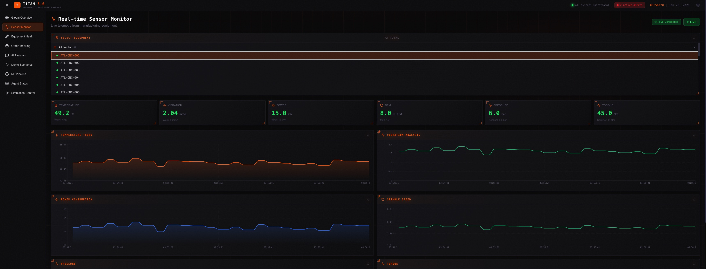
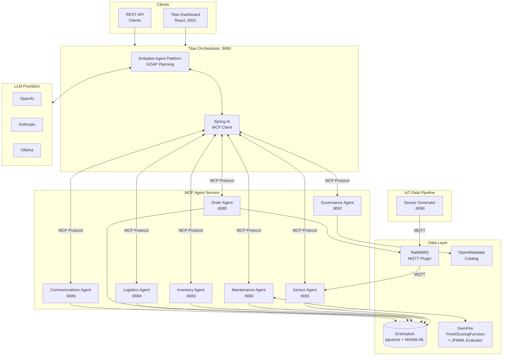
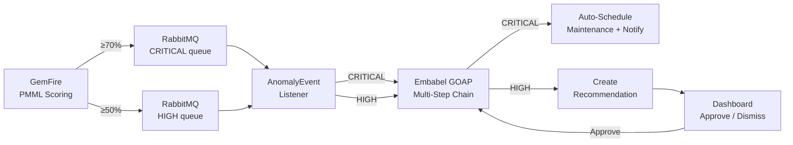
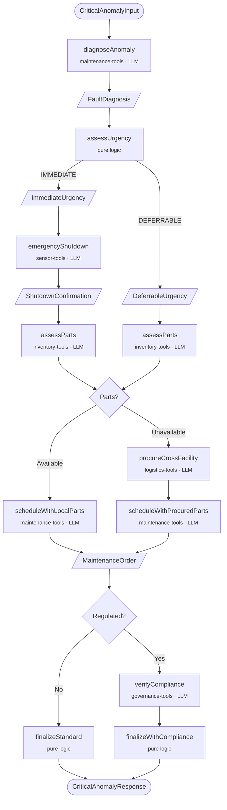
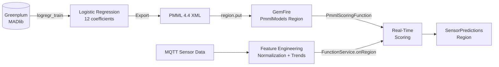

<p align="center">
  
</p>

<h1 align="center">Titan Manufacturing 5.0</h1>

<p align="center">
  <i>"Forging the future with intelligent manufacturing"</i>
</p>

<p align="center">
  
  
  
  
  
  
  
</p>

---

A **multi-agent AI platform** for manufacturing operations, demonstrating enterprise AI orchestration with the [Embabel Agent Framework](https://github.com/embabel/embabel-agent), Spring AI MCP (Model Context Protocol), and Greenplum.

## Overview

**Titan Manufacturing** is a fictional global industrial conglomerate specializing in heavy equipment and precision components for aerospace, energy, and transportation sectors. This demo platform showcases how AI agents can coordinate to solve complex manufacturing challenges.

| Fact | Detail |
|------|--------|
| Founded | 1952, Detroit |
| Headquarters | Atlanta, GA |
| Revenue | $4.2B annually |
| Employees | 8,500 |
| Facilities | 12 smart factories worldwide |
| CNC Machines | 600+ monitored in real-time |
| Products | 50,000+ SKUs |

### Business Divisions

| Division | Products | Key Customers |
|----------|----------|---------------|
| **Titan Aerospace** | Turbine blades, engine housings, landing gear | Apex Aerospace, Horizon Aircraft, SpaceX |
| **Titan Energy** | Wind turbine gearboxes, solar frames, valves | GE, Siemens, Shell |
| **Titan Mobility** | EV motor housings, battery enclosures | Tesla, Ford, Rivian |
| **Titan Industrial** | CNC parts, hydraulic pumps, bearings | Caterpillar, John Deere |

---

## Screenshots

<p align="center">
  
  <br><em>Global Overview — real-time status of 12 smart factories across 4 regions</em>
</p>

<p align="center">
  
  <br><em>Sensor Monitor — 6 live sensor charts with GemFire PMML failure predictions</em>
</p>

---

## Architecture



### Agent Capabilities

| Agent | Port | Role | MCP Tools |
|-------|------|------|-----------|
| **Sensor** | 8081 | IoT data from 600+ CNC machines | `list_equipment`, `get_sensor_readings`, `get_facility_status`, `detect_anomaly` |
| **Maintenance** | 8082 | Predictive maintenance & RUL via GemFire PMML | `predict_failure`, `estimate_rul`, `schedule_maintenance`, `get_maintenance_history` |
| **Inventory** | 8083 | 50K+ SKU management with pgvector | `check_stock`, `search_products`, `find_alternatives`, `calculate_reorder`, `get_compatible_parts` |
| **Logistics** | 8084 | Global shipping optimization | `get_carriers`, `create_shipment`, `track_shipment`, `estimate_shipping` |
| **Order** | 8085 | B2B order fulfillment | `validate_order`, `check_contract_terms`, `initiate_fulfillment`, `get_order_status` |
| **Communications** | 8086 | Customer notifications | `send_notification`, `handle_inquiry`, `draft_customer_update` |
| **Governance** | 8087 | OpenMetadata & compliance | `trace_material_batch`, `get_compliance_report`, `trace_data_lineage` |

---

## Quick Start

### Prerequisites

- Docker & Docker Compose
- Java 21+ (for local development)
- Maven 3.9+
- 16GB+ RAM recommended
- LLM provider: OpenAI API key, Anthropic API key, or Ollama installed locally

### 1. Clone and Configure

```bash
git clone <repo-url>
cd titan-manufacturing

# Configure environment
cp .env.example .env
# Edit .env with your API keys
```

### 2. Start Infrastructure

```bash
# Start core infrastructure (Greenplum + RabbitMQ)
docker compose up -d

# Wait for Greenplum to initialize (~60 seconds)
docker compose logs -f greenplum-init
```

### 3. Start Agents & Orchestrator

**Option A: With Ollama (Local LLM)**

```bash
# Pull and alias model for Embabel
ollama pull llama3.1:8b
ollama create gpt-4.1 -f - <<< "FROM llama3.1:8b"

# Start agents and orchestrator
docker compose --profile agents --profile orchestrator up -d
```

**Option B: With OpenAI**

```bash
echo "OPENAI_API_KEY=sk-your-key" >> .env
docker compose --profile agents --profile orchestrator up -d
```

### 4. Start the Dashboard

```bash
docker compose --profile dashboard up -d

# Access at http://localhost:3001
```

### One-Liner: Start Everything

```bash
# Set your API key (or use Ollama - see step 3)
export ANTHROPIC_API_KEY=your-key-here

# Start all services at once
docker compose --profile agents --profile generator --profile orchestrator --profile dashboard up -d

# Watch the logs
docker compose logs -f
```

### 5. Verify Services

```bash
# Check all containers
docker compose ps

# Test the API
curl -X POST http://localhost:8080/api/chat \
  -H "Content-Type: application/json" \
  -d '{"message": "How many machines are at the Phoenix facility?"}'
```

### Access Points

| Service | URL | Credentials |
|---------|-----|-------------|
| **Titan Dashboard** | http://localhost:3001 | - |
| **Titan API** | http://localhost:8080 | - |
| Sensor MCP Server | http://localhost:8081/mcp | - |
| Maintenance MCP Server | http://localhost:8082/mcp | - |
| Inventory MCP Server | http://localhost:8083/mcp | - |
| Logistics MCP Server | http://localhost:8084/mcp | - |
| Order MCP Server | http://localhost:8085/mcp | - |
| Communications MCP Server | http://localhost:8086/mcp | - |
| Governance MCP Server | http://localhost:8087/mcp | - |
| RabbitMQ Management | http://localhost:15672 | titan / titan5.0 |
| Greenplum | localhost:15432 | gpadmin / VMware1! |
| GemFire Pulse | http://localhost:7070 | (with `--profile gemfire`) |
| OpenMetadata | http://localhost:8585 | (with `--profile governance`) |

---

## Demo Scenarios

The platform includes four core demo scenarios accessible via the Dashboard's Demo Scenarios page:

### 1. Phoenix Incident (Predictive Maintenance)

> *"CNC-007 at the Phoenix plant is showing vibration anomalies - the same pattern that preceded the $12M incident last year..."*

```bash
curl -X POST http://localhost:8080/api/chat \
  -H "Content-Type: application/json" \
  -d '{"message": "Check the health of PHX-CNC-007 and predict if it will fail"}'
```

**What happens:**
- Sensor Agent detects vibration trending up (2.5 → 4.2 mm/s)
- Maintenance Agent predicts ~73% failure probability within 48 hours
- Inventory Agent locates replacement bearing (SKU-BRG-7420)
- System recommends emergency maintenance to prevent $12M downtime

### 2. Apex Expedite (Order Fulfillment)

> *"Apex Aerospace needs 500 turbine blade blanks ASAP for order TM-2024-45892..."*

```bash
curl -X POST http://localhost:8080/api/chat \
  -H "Content-Type: application/json" \
  -d '{"message": "Apex Aerospace needs 500 turbine blade blanks ASAP - order TM-2024-45892"}'
```

**What happens:**
- Order Agent validates contract terms and aerospace compliance
- Inventory Agent finds stock: Phoenix 320 + Munich 400
- Logistics Agent plans split air freight shipment
- Communications Agent confirms ETA to Apex Aerospace

### 3. FAA Audit (Data Governance)

> *"We need to trace titanium batch TI-2024-0892 used in Apex widebody landing gear for an FAA audit..."*

```bash
curl -X POST http://localhost:8080/api/chat \
  -H "Content-Type: application/json" \
  -d '{"message": "Trace titanium batch TI-2024-0892 for FAA audit"}'
```

**What happens:**
- Governance Agent traces complete upstream lineage to TIMET supplier
- Retrieves all certifications (FAA-8110-3 Form, Mill Certificate, CoC)
- Generates compliance report for regulatory submission

### 4. Supply Chain Crisis (Resilience)

> *"Our primary bearing supplier NipponBearing has delayed shipment. Find alternatives..."*

```bash
curl -X POST http://localhost:8080/api/chat \
  -H "Content-Type: application/json" \
  -d '{"message": "Find alternative suppliers for SKU-BRG-7420, NipponBearing delayed"}'
```

**What happens:**
- Inventory Agent searches global inventory using pgvector semantic search
- Finds alternatives: Timken (7-day lead) vs SKF (14-day)
- Calculates EOQ and safety stock requirements
- Logistics Agent estimates expedited shipping costs

---

## Demo Walkthrough: Predictive Maintenance

This step-by-step guide demonstrates the full predictive maintenance flow with live sensor data.

### Prerequisites

Ensure all services are running:
```bash
docker compose --profile agents --profile generator --profile orchestrator --profile dashboard up -d
docker compose ps  # Verify all containers are healthy
```

### Step 1: Open Dashboard Windows

Open two browser tabs:
1. **Simulation Control**: http://localhost:3001 → Navigate to "Simulation Control"
2. **Sensor Monitor**: http://localhost:3001 → Navigate to "Sensor Monitor" → Select **PHX-CNC-001**

### Step 2: Observe Normal Operation

In Sensor Monitor, observe PHX-CNC-001 running normally:
- Temperature: ~50°C (fluctuating ±1-2°C)
- Vibration: ~2.0 mm/s (fluctuating slightly)
- All readings in the "healthy" green zone

### Step 3: Trigger Equipment Degradation

**Option A: Via Simulation Control UI**
1. Find PHX-CNC-001 in the equipment list
2. Change the pattern dropdown from `NORMAL` to `BEARING_DEGRADATION`
3. Click Apply

**Option B: Via Phoenix Incident Button**
```bash
curl -X POST http://localhost:8090/api/generator/scenarios/phoenix-incident
```

**Option C: Via Direct API**
```bash
curl -X POST "http://localhost:8090/api/generator/equipment/PHX-CNC-001/pattern?pattern=BEARING_DEGRADATION"
```

### Step 4: Watch Degradation Progress (~2 minutes)

In Sensor Monitor, watch the sensor values change over time:

| Time | Vibration | Temperature | Status |
|------|-----------|-------------|--------|
| 0:00 | 2.0 mm/s | 50°C | Normal (reset to baseline) |
| 0:30 | 2.6 mm/s | 55°C | Trending up |
| 1:00 | 3.2 mm/s | 60°C | Approaching warning |
| 1:30 | 3.8 mm/s | 64°C | **WARNING** threshold crossed |
| 2:00 | 4.4 mm/s | 69°C | High risk |
| 2:30 | 5.0 mm/s | 74°C | **CRITICAL** threshold crossed |

### Step 5: Query Predictive Maintenance

After 1-2 minutes of degraded data accumulating, ask the AI to analyze:

**Via Chat Interface** (http://localhost:3001 → Chat):
> "What is the failure probability for PHX-CNC-001?"

**Via API**:
```bash
curl -X POST http://localhost:8080/api/chat \
  -H "Content-Type: application/json" \
  -d '{"message": "Predict failure probability for PHX-CNC-001 and recommend action"}'
```

### Step 6: Review AI Response

The Maintenance Agent analyzes sensor trends and returns:

```
PHX-CNC-001 Analysis:
- Failure Probability: 73%
- Risk Level: HIGH
- Hours to Failure: 48

Risk Factors:
- Vibration: 4.2 mm/s (WARNING) - trending up at 0.1 mm/s per cycle
- Temperature: 65°C - correlated with vibration increase

Recommendations:
1. Schedule immediate maintenance inspection
2. Check bearing condition - vibration pattern suggests bearing wear
3. Recommend replacement: SKU-BRG-7420 (Spindle Bearing)
4. Consider reducing equipment load until maintenance
```

### Step 7: Reset Equipment

After the demo, reset to normal:

```bash
# Reset single equipment
curl -X POST "http://localhost:8090/api/generator/equipment/PHX-CNC-001/reset"

# Or reset all equipment
curl -X POST http://localhost:8090/api/generator/reset-all
```

### Degradation Patterns Available

| Pattern | Vibration | Temp | Power | RPM | Pressure | Torque | Time to Warning |
|---------|-----------|------|-------|-----|----------|--------|-----------------|
| `BEARING_DEGRADATION` | ↑↑ primary | ↑ follows vib | slight ↑ | ↓ slow | flat | ↑ drag | ~4 min |
| `MOTOR_BURNOUT` | erratic spikes | ↑↑↑ rising | ↑↑ surge | ↓↓ dropping | flat | slight ↑ | ~5 min |
| `SPINDLE_WEAR` | ↑ slow | slight ↑ | flat | ↓↓ primary | flat | erratic spikes | ~4 min |
| `COOLANT_FAILURE` | slight ↑ | ↑↑ | flat | flat | ↓↓ primary | slight ↑ | ~6 min |
| `ELECTRICAL_FAULT` | erratic ×3 | ↑ | ↑↑ surges | ↓↓ | slight ↓ | erratic ×3 | ~3 min |

### Troubleshooting

**Sensor Monitor shows "Disconnected"**
- Verify sensor-mcp-server is running: `docker compose logs sensor-mcp-server --tail 10`
- Check SSE endpoint: `curl http://localhost:8081/api/sensors/stream?equipmentId=PHX-CNC-001`

**No prediction data**
- Ensure sensor data has accumulated (wait 1-2 min after triggering degradation)
- Check maintenance-mcp-server logs: `docker compose logs maintenance-mcp-server --tail 20`

**Generator not responding**
- Restart generator: `docker compose restart sensor-data-generator`
- Check status: `curl http://localhost:8090/api/generator/status`

---

## Autonomous Anomaly Response

When equipment risk scores cross thresholds, the platform triggers autonomous responses via RabbitMQ events and the Embabel GOAP planner — no human intervention needed for critical failures.

### How It Works



- **CRITICAL (≥70%)**: Full automated response — diagnose fault, find compatible parts, schedule emergency maintenance, notify personnel
- **HIGH (≥50%)**: Creates a recommendation with reserved parts, awaiting human approval via the dashboard
- **Approval**: When a human approves a HIGH recommendation, it triggers the same CRITICAL chain

### GOAP Anomaly Resolution Chain



### Equipment Parts Compatibility

The `equipment_parts_compatibility` table (102 rows) links 7 equipment models to specific replacement parts by fault type. The `get_compatible_parts` MCP tool uses this matrix so the agent finds model-specific parts rather than guessing from a diagnosis string.

For example, a bearing fault on a **DMG MORI DMU 50** returns `INDL-BRG-7420` (angular contact bearing), while the same fault on a **Mazak VTC-800** returns `INDL-BRG-7421` (cylindrical bearing) — different machines need different parts.

See [docs/embabel-architecture.md](docs/embabel-architecture.md) for the full GOAP chain design with 3 branch points (urgency, parts availability, regulatory compliance).

---

## Project Structure

```
titan-manufacturing/
├── pom.xml                      # Parent Maven POM
├── docker-compose.yml           # Full stack definition
├── .env.example                 # Environment template
│
├── titan-orchestrator/          # Embabel-based agent coordinator
│   └── src/main/java/com/titan/orchestrator/
│       ├── agent/               # TitanAnomalyAgent (GOAP multi-step chain)
│       ├── config/              # McpToolGroupsConfiguration, RabbitConfig
│       ├── controller/          # REST API + RecommendationController
│       ├── listener/            # AnomalyEventListener (RabbitMQ)
│       ├── model/               # AnomalyEvent, AnomalyResponse records
│       └── service/             # RecommendationService, AutomatedActionService, NotificationService
│
├── sensor-mcp-server/           # IoT sensor data (Port 8081)
├── maintenance-mcp-server/      # Predictive maintenance (Port 8082)
├── inventory-mcp-server/        # SKU management (Port 8083)
├── logistics-mcp-server/        # Shipping optimization (Port 8084)
├── order-mcp-server/            # B2B fulfillment (Port 8085)
├── communications-mcp-server/   # Customer notifications (Port 8086)
├── governance-mcp-server/       # Compliance & lineage (Port 8087)
│
├── gemfire-scoring-function/     # GemFire server-side PMML scoring (deployed via gfsh)
│   └── src/main/java/com/titan/gemfire/
│       └── PmmlScoringFunction.java  # GemFire Function — evaluates PMML with JPMML
│
├── sensor-data-generator/       # IoT sensor simulator (Port 8090)
│
├── titan-dashboard/             # React UI (Port 3001)
│   ├── src/components/
│   │   ├── GlobalOverview.tsx   # World map with 12 facilities
│   │   ├── SensorMonitor.tsx    # Real-time 6-sensor charts + ML predictions
│   │   ├── EquipmentHealth.tsx  # Predictive maintenance dashboard
│   │   ├── OrderTracker.tsx     # Order fulfillment pipeline
│   │   ├── ChatInterface.tsx    # Natural language AI chat
│   │   ├── DemoScenarios.tsx    # Pre-built workflow demos
│   │   ├── AgentStatus.tsx      # MCP agent health monitor
│   │   ├── SimulationControl.tsx # Equipment degradation pattern control
│   │   └── MLPipeline.tsx       # ML pipeline visualization
│   └── Dockerfile               # Multi-stage build with nginx
│
├── config/
│   ├── greenplum/init.sql       # Database schema + ML models + seed data
│   ├── rabbitmq/                # MQTT plugin config
│   └── openmetadata/            # OpenMetadata setup scripts
│
└── scripts/
    └── generate_embeddings.py   # pgvector embedding generator
```

---

## Technology Stack

| Layer | Technology | Purpose |
|-------|------------|---------|
| **Dashboard** | React 19 + Vite 7 + Tailwind 4 | Industrial control room UI |
| **Orchestration** | [Embabel Agent Framework](https://github.com/embabel/embabel-agent) | GOAP-based goal planning |
| **MCP Protocol** | Spring AI MCP 1.1.2 | Tool registration and invocation |
| **LLM Integration** | Spring AI | OpenAI, Anthropic, Ollama support |
| **Database** | Greenplum 7 + pgvector + MADlib | Analytics, vector embeddings, ML training |
| **In-Memory Scoring** | VMware Tanzu GemFire 10.2 + JPMML 1.6 | Server-side PMML model evaluation via GemFire Functions |
| **Messaging** | RabbitMQ (MQTT plugin) | IoT sensor data ingestion |
| **Data Catalog** | OpenMetadata 1.3 | Governance & lineage |
| **Runtime** | Java 21 + Spring Boot 3.4 | Application framework |
| **Containers** | Docker Compose | Development deployment |

---

## Development

### Build from Source

```bash
# Build all Java modules
mvn clean package -DskipTests

# Build dashboard
cd titan-dashboard && npm install && npm run build
```

### Run Locally

```bash
# Terminal 1: Start infrastructure
docker compose up -d greenplum rabbitmq

# Terminal 2: Start an MCP server
cd sensor-mcp-server && mvn spring-boot:run

# Terminal 3: Start orchestrator
cd titan-orchestrator && mvn spring-boot:run

# Terminal 4: Start dashboard (dev mode)
cd titan-dashboard && npm run dev
```

### Docker Compose Profiles

| Profile | Services | Use Case |
|---------|----------|----------|
| (default) | Greenplum, RabbitMQ | Infrastructure only |
| `agents` | All 7 MCP servers | Agent layer |
| `orchestrator` | Titan Orchestrator | Coordination layer |
| `dashboard` | Titan Dashboard | UI |
| `generator` | Sensor Data Generator | IoT simulation |
| `gemfire` | GemFire (Apache Geode) | Real-time ML scoring cache |
| `governance` | OpenMetadata stack | Data governance |
| `observability` | Grafana, Prometheus | Monitoring |

```bash
# Start everything
docker compose --profile agents --profile orchestrator --profile dashboard up -d

# Start with IoT simulation
docker compose --profile agents --profile orchestrator --profile generator up -d
```

### Environment Variables

| Variable | Default | Description |
|----------|---------|-------------|
| `OPENAI_API_KEY` | - | OpenAI API key |
| `ANTHROPIC_API_KEY` | - | Anthropic API key |
| `OPENAI_BASE_URL` | `http://host.docker.internal:11434` | Ollama endpoint |
| `OPENAI_MODEL` | `llama3.1:8b` | Model for Ollama |
| `DEFAULT_LLM` | `gpt-4.1` | Embabel default LLM name |

---

## Data Model

### Manufacturing Data (Greenplum)

- **12 facilities** across NA, EU, APAC, LATAM regions
- **600+ CNC machines** with real-time sensor monitoring
- **50,000+ SKUs** with pgvector embeddings for semantic search
- **6 Sensor types**: vibration (mm/s), temperature (°C), power (kW), spindle speed (RPM), pressure (bar), torque (Nm)

### ML-Based Predictive Maintenance

**Train in Greenplum → Export PMML → Deploy to GemFire → GemFire scores in real-time**



- **Training**: MADlib `logregr_train` in Greenplum produces logistic regression with 12 coefficients (intercept + 11 features)
- **Export**: Model exported as PMML 4.4 XML and stored in GemFire `PmmlModels` REPLICATE region
- **Scoring**: GemFire server-side `PmmlScoringFunction` evaluates PMML using JPMML-evaluator — scores 72 equipment per 30s cycle
- **Features**: 6 normalized sensor values (vibration, temperature, power, RPM, pressure, torque), vibration/temperature trend rates, days since maintenance, equipment age, anomaly count
- **Deployment**: Function JAR deployed via `gfsh deploy --jar` with JAXB runtime bundled (JDK 17 target)
- Heuristic failure diagnosis identifies specific failure type (bearing, electrical, coolant, motor, spindle)
- Run-to-failure data modeled after NASA C-MAPSS datasets
- SQL functions: `predict_equipment_failure()`, `estimate_equipment_rul()`

### Degradation Patterns

The sensor data generator simulates realistic failure patterns calibrated against the PMML logistic regression model. Each pattern's degradation rates and cycle caps are tuned so the model scores in the HIGH band (probability 0.5–0.7) when capped.

| Pattern | Primary Sensors | Key Rates (per cycle) | HIGH Cap | Demo Signature |
|---------|----------------|----------------------|----------|----------------|
| `NORMAL` | All stable | Gaussian noise only | — | Baseline healthy operation |
| `BEARING_DEGRADATION` | Vibration ↑, Temperature ↑ | vib +0.035, temp follows vib×6 | 70 cycles | Phoenix Incident — vibration 2→4.5 mm/s |
| `MOTOR_BURNOUT` | Temperature ↑, Power ↑, RPM ↓ | temp +0.35°C, power +0.12 kW, RPM −18 | 80 cycles | Temperature 50→78°C, motor overheating |
| `SPINDLE_WEAR` | RPM ↓, Vibration ↑, Torque ↑ | RPM −20, vib +0.04, torque +0.1 | 90 cycles | RPM 8500→6700, spindle wobble |
| `COOLANT_FAILURE` | Temperature ↑, Pressure ↓ | temp +0.25°C, pressure −0.045 bar | 100 cycles | Pressure 6.0→1.5 bar, thermal runaway |
| `ELECTRICAL_FAULT` | Power ↑, RPM ↓, Vibration ↑ | power +0.15 kW, RPM −25, vib +0.03 | 85 cycles | Erratic power spikes to 30+ kW |

**Cycle timing**: At 1x speed (5s ticks), patterns reach HIGH cap in 6–8 minutes. At 10x speed, 40–60 seconds.

**Calibration basis**: Model coefficients — `vibration_trend_rate` (106.2), `rpm_normalized` (−57.6), `pressure_normalized` (−54.6), `vibration_normalized` (44.2), `temperature_trend_rate` (42.6), `temperature_normalized` (28.7). Degradation rates push normalized features far enough from baseline to shift the logit by ~24 points.

---

## Contributing

Contributions are welcome! Please ensure your changes:

1. Follow the existing MCP tool annotation patterns (`@McpTool`, `@McpToolParam`)
2. Include appropriate logging
3. Handle database schema alignment
4. Update documentation as needed

---

## License

Distributed under the MIT License. See [LICENSE](LICENSE) for details.

---

<p align="center">
  <b>Titan Manufacturing 5.0</b><br>
  <i>"Forging the future with intelligent manufacturing"</i>
</p>
