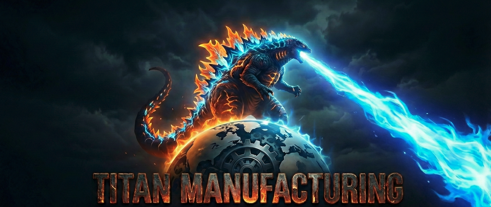

<p align="center">
  
</p>

<h1 align="center">Titan Manufacturing AI Platform</h1>

<p align="center">
  <i>"Forging the future with intelligent manufacturing"</i>
</p>

<p align="center">
  
  
  
  
  
</p>

---

A **multi-agent AI platform** for manufacturing operations, demonstrating enterprise AI orchestration with the [Embabel Agent Framework](https://github.com/embabel/embabel-agent), Spring AI MCP, and Greenplum.

## About Titan Manufacturing

**Titan Manufacturing** is a global industrial conglomerate specializing in heavy equipment and precision components for aerospace, energy, and transportation sectors.

| Fact | Detail |
|------|--------|
| Founded | 1952, Detroit |
| Headquarters | Atlanta, GA |
| Revenue | $4.2B annually |
| Employees | 8,500 |
| Facilities | 12 smart factories worldwide |
| CNC Machines | 600+ monitored in real-time |
| Products | 50,000+ SKUs |

### Divisions

| Division | Products | Key Customers |
|----------|----------|---------------|
| **Titan Aerospace** | Turbine blades, engine housings, landing gear | Boeing, Airbus, SpaceX |
| **Titan Energy** | Wind turbine gearboxes, solar frames, valves | GE, Siemens, Shell |
| **Titan Mobility** | EV motor housings, battery enclosures | Tesla, Ford, Rivian |
| **Titan Industrial** | CNC parts, hydraulic pumps, bearings | Caterpillar, John Deere |

### The Titan Initiative

CEO **Margaret "Maggie" Chen** launched this initiative after:
- $12M unplanned downtime incident (bearing failure cascade at Phoenix plant)
- 23% order delays from supply chain disruptions
- $8M in warranty claims from quality escapes
- FAA audit findings on data lineage gaps

**This multi-agent AI platform is the solution.**

---

## Architecture


### Agent Capabilities

| Agent | Role | MCP Tools | Status |
|-------|------|-----------|--------|
| **Sensor Agent** | IoT data from 600+ CNC machines | `list_equipment`, `get_equipment_status`, `get_sensor_readings`, `get_facility_status`, `detect_anomaly` | Complete |
| **Maintenance Agent** | Predictive maintenance & RUL | `predict_failure`, `estimate_rul`, `schedule_maintenance`, `get_maintenance_history` | Complete |
| **Inventory Agent** | 50K+ SKU management | `check_stock`, `search_products`, `calculate_reorder` | Planned |
| **Logistics Agent** | Global shipping optimization | `plan_route`, `select_carrier`, `predict_eta` | Planned |
| **Order Agent** | B2B order fulfillment | `validate_order`, `check_availability`, `initiate_fulfillment` | Planned |
| **Communications Agent** | Customer notifications | `send_notification`, `handle_inquiry` | Planned |
| **Governance Agent** | OpenMetadata integration | `search_assets`, `get_lineage`, `check_pii` | Planned |

---

## Quick Start

### Prerequisites

- Docker & Docker Compose
- Java 21+ (for local development)
- Maven 3.9+
- 16GB+ RAM recommended
- LLM provider: OpenAI API key, Anthropic API key, or Ollama installed locally

### 1. Clone and Configure

```bash
git clone <repo-url>
cd titan-manufacturing

# Configure environment
cp .env.example .env
# Edit .env with your API keys
```

### 2. Start the Stack

**Option A: With Ollama (Local LLM - Recommended for Development)**

```bash
# Pull a model that supports tool calling
ollama pull llama3.1:8b

# Create model alias (required - Embabel uses model name "gpt-4.1")
ollama create gpt-4.1 -f - <<< "FROM llama3.1:8b"

# Start everything (infrastructure + agents)
docker compose --profile orchestrator --profile agents up -d
```

> **Why the model alias?** The Embabel framework uses the model name `gpt-4.1` internally.
> Since Ollama requires exact model names, we create an alias that maps `gpt-4.1` to `llama3.1:8b`.

**Option B: With OpenAI**

```bash
# Set your API key in .env
echo "OPENAI_API_KEY=sk-your-key" >> .env

# Start everything
docker compose --profile orchestrator --profile agents up -d
```

### 3. Verify Services

```bash
# Check all containers are healthy
docker compose ps

# View orchestrator logs
docker compose logs -f titan-orchestrator
```

### 4. Test the API

```bash
# Chat endpoint - natural language queries
curl -X POST http://localhost:8080/api/chat \
  -H "Content-Type: application/json" \
  -d '{"message": "How many pieces of equipment are at the Phoenix facility?"}'

# Equipment health analysis
curl http://localhost:8080/api/equipment/PHX-CNC-007/health

# Facility status
curl -X POST http://localhost:8080/api/chat \
  -H "Content-Type: application/json" \
  -d '{"message": "What is the overall health status of the Phoenix facility?"}'
```

### Access Points

| Service | URL | Credentials |
|---------|-----|-------------|
| Titan API | http://localhost:8080 | - |
| Sensor MCP Server | http://localhost:8081/mcp | - |
| Maintenance MCP Server | http://localhost:8082/mcp | - |
| Sensor Data Generator | http://localhost:8090 | (with `--profile generator`) |
| RabbitMQ Management | http://localhost:15672 | titan / titan5.0 |
| Greenplum | localhost:15432 | gpadmin / VMware1! |
| OpenMetadata | http://localhost:8585 | (with `--profile governance`) |
| Grafana | http://localhost:3000 | (with `--profile observability`) |

---

## Demo Scenarios

### Scenario 1: The Phoenix Incident (Predictive Maintenance)

> *"CNC-007 at the Phoenix plant is showing vibration anomalies - the same pattern that preceded the $12M incident last year..."*

```bash
# Check equipment health and predict failure
curl -X POST http://localhost:8080/api/chat \
  -H "Content-Type: application/json" \
  -d '{"message": "Check the health of PHX-CNC-007 and predict if it will fail"}'
```

**Expected Response:**
- Vibration trending up (2.5 → 4.2 mm/s)
- ~73% failure probability (ML-based logistic regression)
- Predicted failure within 48 hours
- Risk level: HIGH
- Recommended action: Schedule bearing replacement (SKU-BRG-7420)

### Scenario 2: Facility Health Overview

```bash
curl -X POST http://localhost:8080/api/chat \
  -H "Content-Type: application/json" \
  -d '{"message": "What is the overall health status of the Phoenix facility?"}'
```

**Expected Response:**
- 98.4% facility health
- 63/64 equipment operational
- 1 equipment with active anomaly (PHX-CNC-007)

### Scenario 3: Equipment Inventory

```bash
curl -X POST http://localhost:8080/api/chat \
  -H "Content-Type: application/json" \
  -d '{"message": "List all CNC lathes at the Munich facility"}'
```

### Future Scenarios (Planned)

- **Boeing Expedite**: Multi-agent order fulfillment with inventory and logistics coordination
- **FAA Audit**: Data lineage tracing with OpenMetadata governance agent
- **Supply Chain Crisis**: Supplier substitution with pgvector semantic search

---

## Project Structure

```
titan-manufacturing/
├── pom.xml                      # Parent Maven POM
├── docker-compose.yml           # Full stack definition
├── .env.example                 # Environment template
│
├── titan-orchestrator/          # Embabel-based agent coordinator
│   └── src/main/java/com/titan/orchestrator/
│       ├── agent/               # TitanSensorAgent, TitanMaintenanceAgent
│       ├── config/              # McpToolGroupsConfiguration
│       ├── controller/          # REST API endpoints
│       └── model/               # Domain models
│
├── sensor-mcp-server/           # IoT sensor data MCP server
│   └── src/main/java/com/titan/sensor/
│       ├── service/             # SensorService (@McpTool methods)
│       ├── mqtt/                # SensorDataConsumer (MQTT → Greenplum)
│       └── model/               # Equipment, Anomaly, SensorReading
│
├── sensor-data-generator/       # IoT sensor simulator
│   └── src/main/java/com/titan/generator/
│       ├── SensorDataGenerator  # Publishes readings to MQTT
│       ├── DegradationPattern   # Failure pattern definitions
│       └── GeneratorController  # REST API for pattern control
│
├── maintenance-mcp-server/      # Predictive maintenance MCP server
│   └── src/main/java/com/titan/maintenance/
│       ├── service/             # MaintenanceService (ML prediction)
│       └── model/               # FailurePrediction, RulEstimate
│
├── inventory-mcp-server/        # Parts & SKU management (planned)
├── logistics-mcp-server/        # Shipping optimization (planned)
├── order-mcp-server/            # B2B fulfillment (planned)
├── communications-mcp-server/   # Notifications (planned)
├── governance-mcp-server/       # OpenMetadata integration (planned)
├── titan-dashboard/             # React demo UI (planned)
│
├── config/
│   ├── greenplum/init.sql       # Database schema, ML model, seed data
│   └── rabbitmq/                # MQTT plugin config
│
└── docs/
    ├── images/                  # Project images
    ├── DATASETS.md              # Data model documentation
    └── BUILD_PLAN.md            # Implementation roadmap
```

---

## Technology Stack

| Layer | Technology | Purpose |
|-------|------------|---------|
| **Orchestration** | [Embabel Agent Framework](https://github.com/embabel/embabel-agent) | GOAP-based goal planning, action execution |
| **MCP Protocol** | Spring AI MCP 1.1.2 | Tool registration and invocation |
| **LLM Integration** | Spring AI | OpenAI, Anthropic, Ollama support |
| **Database** | Greenplum 7 + pgvector | Analytics, vector embeddings |
| **Messaging** | RabbitMQ (MQTT plugin) | IoT sensor data ingestion |
| **Data Catalog** | OpenMetadata 1.3 | Governance & lineage |
| **Runtime** | Java 21 + Spring Boot 3.4 | Application framework |
| **Containers** | Docker Compose | Development deployment |

---

## Development

### Build from Source

```bash
# Build all modules
mvn clean package -DskipTests

# Build specific module
mvn -pl sensor-mcp-server package -DskipTests
```

### Run Locally (without Docker)

```bash
# Terminal 1: Start sensor MCP server
cd sensor-mcp-server
mvn spring-boot:run

# Terminal 2: Start orchestrator
cd titan-orchestrator
mvn spring-boot:run
```

### Environment Variables

| Variable | Default | Description |
|----------|---------|-------------|
| `OPENAI_API_KEY` | - | OpenAI API key |
| `ANTHROPIC_API_KEY` | - | Anthropic API key |
| `OPENAI_BASE_URL` | `http://localhost:11434` | Ollama endpoint |
| `OPENAI_MODEL` | `llama3.1:8b` | Model for Ollama |
| `DEFAULT_LLM` | `gpt-4.1` | Embabel default LLM name |
| `MCP_SERVERS_SENSOR` | `http://localhost:8081` | Sensor MCP server URL |

---

## Implementation Status

| Increment | Component | Status |
|-----------|-----------|--------|
| 1 | Foundation (Greenplum, RabbitMQ) | Complete |
| 2 | Embabel Orchestrator + Sensor Agent | Complete |
| 3 | Predictive Maintenance Agent + Sensor Data Generator | Complete |
| 4 | Supply Chain (Inventory + Logistics) | Planned |
| 5 | Order Fulfillment Agent | Planned |
| 6 | Data Governance (OpenMetadata) | Planned |
| 7 | React Dashboard | Planned |

---

## Data Model

### Factory Equipment (Greenplum)
- 12 facilities x ~50 CNC machines each (600+ total)
- Equipment types: CNC-MILL, CNC-LATHE, CNC-5AX, HYD-PRESS, LASER-CUT, WELD-ROB, HEAT-TREAT, EDM, GRIND, CMM
- Sensor readings: vibration (mm/s), temperature (C), RPM, torque (Nm), pressure (PSI)

### ML-Based Predictive Maintenance
- **Logistic regression model** with stored coefficients in Greenplum
- **Feature engineering view** (`equipment_ml_features`) for real-time prediction
- **Run-to-failure data** modeled after NASA C-MAPSS turbofan datasets
- SQL functions: `predict_equipment_failure()`, `estimate_equipment_rul()`

### Sensor Data Pipeline
- **Generator** publishes sensor readings via MQTT to RabbitMQ
- **Consumer** in sensor-mcp-server writes to Greenplum `sensor_readings` table
- **Degradation patterns**: NORMAL, BEARING_DEGRADATION, MOTOR_BURNOUT, SPINDLE_WEAR, COOLANT_FAILURE, ELECTRICAL_FAULT

### Anomaly Detection
- Threshold-based anomaly detection per sensor type
- Active anomalies tracked with confidence scores
- Predicted failure dates for proactive maintenance

### Parts Catalog
- 50,000+ SKUs across 4 divisions
- Supplier relationships and lead times
- pgvector embeddings for semantic search

---

## Contributing

Contributions are welcome! Please read the existing code patterns and ensure your changes:

1. Follow the existing MCP tool annotation patterns (`@McpTool`, `@McpToolParam`)
2. Include appropriate logging
3. Handle database schema alignment
4. Update tests as needed

---

## License

Distributed under the MIT License. See [LICENSE](LICENSE) for details.

---

<p align="center">
  <b>Titan Manufacturing</b><br>
  <i>"Forging the future with intelligent manufacturing"</i>
</p>
