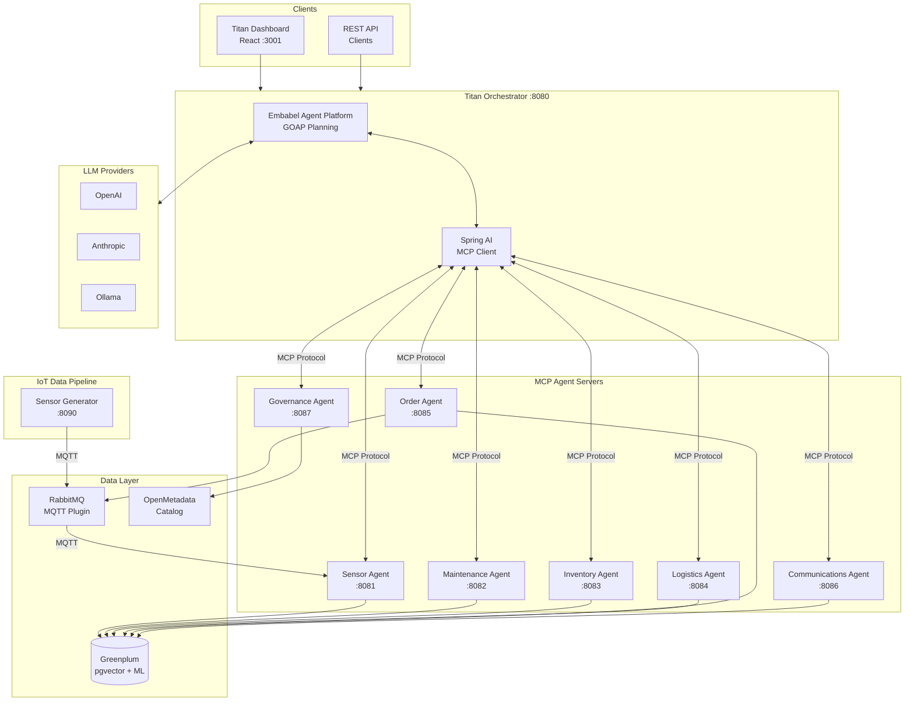

<p align="center">
  
</p>

<h1 align="center">Titan Manufacturing 5.0</h1>

<p align="center">
  <i>"Forging the future with intelligent manufacturing"</i>
</p>

<p align="center">
  
  
  
  
  
  
</p>

---

A **multi-agent AI platform** for manufacturing operations, demonstrating enterprise AI orchestration with the [Embabel Agent Framework](https://github.com/embabel/embabel-agent), Spring AI MCP (Model Context Protocol), and Greenplum.

## Overview

**Titan Manufacturing** is a fictional global industrial conglomerate specializing in heavy equipment and precision components for aerospace, energy, and transportation sectors. This demo platform showcases how AI agents can coordinate to solve complex manufacturing challenges.

| Fact | Detail |
|------|--------|
| Founded | 1952, Detroit |
| Headquarters | Atlanta, GA |
| Revenue | $4.2B annually |
| Employees | 8,500 |
| Facilities | 12 smart factories worldwide |
| CNC Machines | 600+ monitored in real-time |
| Products | 50,000+ SKUs |

### Business Divisions

| Division | Products | Key Customers |
|----------|----------|---------------|
| **Titan Aerospace** | Turbine blades, engine housings, landing gear | Boeing, Airbus, SpaceX |
| **Titan Energy** | Wind turbine gearboxes, solar frames, valves | GE, Siemens, Shell |
| **Titan Mobility** | EV motor housings, battery enclosures | Tesla, Ford, Rivian |
| **Titan Industrial** | CNC parts, hydraulic pumps, bearings | Caterpillar, John Deere |

---

## Architecture



### Agent Capabilities

| Agent | Port | Role | MCP Tools |
|-------|------|------|-----------|
| **Sensor** | 8081 | IoT data from 600+ CNC machines | `list_equipment`, `get_sensor_readings`, `get_facility_status`, `detect_anomaly` |
| **Maintenance** | 8082 | Predictive maintenance & RUL | `predict_failure`, `estimate_rul`, `schedule_maintenance`, `get_maintenance_history` |
| **Inventory** | 8083 | 50K+ SKU management with pgvector | `check_stock`, `search_products`, `find_alternatives`, `calculate_reorder` |
| **Logistics** | 8084 | Global shipping optimization | `get_carriers`, `create_shipment`, `track_shipment`, `estimate_shipping` |
| **Order** | 8085 | B2B order fulfillment | `validate_order`, `check_contract_terms`, `initiate_fulfillment`, `get_order_status` |
| **Communications** | 8086 | Customer notifications | `send_notification`, `handle_inquiry`, `draft_customer_update` |
| **Governance** | 8087 | OpenMetadata & compliance | `trace_material_batch`, `get_compliance_report`, `trace_data_lineage` |

---

## Quick Start

### Prerequisites

- Docker & Docker Compose
- Java 21+ (for local development)
- Maven 3.9+
- 16GB+ RAM recommended
- LLM provider: OpenAI API key, Anthropic API key, or Ollama installed locally

### 1. Clone and Configure

```bash
git clone <repo-url>
cd titan-manufacturing

# Configure environment
cp .env.example .env
# Edit .env with your API keys
```

### 2. Start Infrastructure

```bash
# Start core infrastructure (Greenplum + RabbitMQ)
docker compose up -d

# Wait for Greenplum to initialize (~60 seconds)
docker compose logs -f greenplum-init
```

### 3. Start Agents & Orchestrator

**Option A: With Ollama (Local LLM)**

```bash
# Pull and alias model for Embabel
ollama pull llama3.1:8b
ollama create gpt-4.1 -f - <<< "FROM llama3.1:8b"

# Start agents and orchestrator
docker compose --profile agents --profile orchestrator up -d
```

**Option B: With OpenAI**

```bash
echo "OPENAI_API_KEY=sk-your-key" >> .env
docker compose --profile agents --profile orchestrator up -d
```

### 4. Start the Dashboard

```bash
docker compose --profile dashboard up -d

# Access at http://localhost:3001
```

### 5. Verify Services

```bash
# Check all containers
docker compose ps

# Test the API
curl -X POST http://localhost:8080/api/chat \
  -H "Content-Type: application/json" \
  -d '{"message": "How many machines are at the Phoenix facility?"}'
```

### Access Points

| Service | URL | Credentials |
|---------|-----|-------------|
| **Titan Dashboard** | http://localhost:3001 | - |
| **Titan API** | http://localhost:8080 | - |
| Sensor MCP Server | http://localhost:8081/mcp | - |
| Maintenance MCP Server | http://localhost:8082/mcp | - |
| Inventory MCP Server | http://localhost:8083/mcp | - |
| Logistics MCP Server | http://localhost:8084/mcp | - |
| Order MCP Server | http://localhost:8085/mcp | - |
| Communications MCP Server | http://localhost:8086/mcp | - |
| Governance MCP Server | http://localhost:8087/mcp | - |
| RabbitMQ Management | http://localhost:15672 | titan / titan5.0 |
| Greenplum | localhost:15432 | gpadmin / VMware1! |
| OpenMetadata | http://localhost:8585 | (with `--profile governance`) |

---

## Demo Scenarios

The platform includes four core demo scenarios accessible via the Dashboard's Demo Scenarios page:

### 1. Phoenix Incident (Predictive Maintenance)

> *"CNC-007 at the Phoenix plant is showing vibration anomalies - the same pattern that preceded the $12M incident last year..."*

```bash
curl -X POST http://localhost:8080/api/chat \
  -H "Content-Type: application/json" \
  -d '{"message": "Check the health of PHX-CNC-007 and predict if it will fail"}'
```

**What happens:**
- Sensor Agent detects vibration trending up (2.5 → 4.2 mm/s)
- Maintenance Agent predicts ~73% failure probability within 48 hours
- Inventory Agent locates replacement bearing (SKU-BRG-7420)
- System recommends emergency maintenance to prevent $12M downtime

### 2. Boeing Expedite (Order Fulfillment)

> *"Boeing needs 500 turbine blade blanks ASAP for order TM-2024-45892..."*

```bash
curl -X POST http://localhost:8080/api/chat \
  -H "Content-Type: application/json" \
  -d '{"message": "Boeing needs 500 turbine blade blanks ASAP - order TM-2024-45892"}'
```

**What happens:**
- Order Agent validates contract terms and aerospace compliance
- Inventory Agent finds stock: Phoenix 320 + Munich 400
- Logistics Agent plans split air freight shipment
- Communications Agent confirms ETA to Boeing

### 3. FAA Audit (Data Governance)

> *"We need to trace titanium batch TI-2024-0892 used in Boeing 787 landing gear for an FAA audit..."*

```bash
curl -X POST http://localhost:8080/api/chat \
  -H "Content-Type: application/json" \
  -d '{"message": "Trace titanium batch TI-2024-0892 for FAA audit"}'
```

**What happens:**
- Governance Agent traces complete upstream lineage to TIMET supplier
- Retrieves all certifications (FAA-8110-3 Form, Mill Certificate, CoC)
- Generates compliance report for regulatory submission

### 4. Supply Chain Crisis (Resilience)

> *"Our primary bearing supplier NipponBearing has delayed shipment. Find alternatives..."*

```bash
curl -X POST http://localhost:8080/api/chat \
  -H "Content-Type: application/json" \
  -d '{"message": "Find alternative suppliers for SKU-BRG-7420, NipponBearing delayed"}'
```

**What happens:**
- Inventory Agent searches global inventory using pgvector semantic search
- Finds alternatives: Timken (7-day lead) vs SKF (14-day)
- Calculates EOQ and safety stock requirements
- Logistics Agent estimates expedited shipping costs

---

## Project Structure

```
titan-manufacturing/
├── pom.xml                      # Parent Maven POM
├── docker-compose.yml           # Full stack definition
├── .env.example                 # Environment template
│
├── titan-orchestrator/          # Embabel-based agent coordinator
│   └── src/main/java/com/titan/orchestrator/
│       ├── agent/               # All 7 TitanAgent implementations
│       ├── config/              # McpToolGroupsConfiguration
│       └── controller/          # REST API endpoints
│
├── sensor-mcp-server/           # IoT sensor data (Port 8081)
├── maintenance-mcp-server/      # Predictive maintenance (Port 8082)
├── inventory-mcp-server/        # SKU management (Port 8083)
├── logistics-mcp-server/        # Shipping optimization (Port 8084)
├── order-mcp-server/            # B2B fulfillment (Port 8085)
├── communications-mcp-server/   # Customer notifications (Port 8086)
├── governance-mcp-server/       # Compliance & lineage (Port 8087)
│
├── sensor-data-generator/       # IoT sensor simulator (Port 8090)
│
├── titan-dashboard/             # React UI (Port 3001)
│   ├── src/components/
│   │   ├── GlobalOverview.tsx   # World map with 12 facilities
│   │   ├── SensorMonitor.tsx    # Real-time sensor charts
│   │   ├── EquipmentHealth.tsx  # Predictive maintenance dashboard
│   │   ├── OrderTracker.tsx     # Order fulfillment pipeline
│   │   ├── ChatInterface.tsx    # Natural language AI chat
│   │   ├── DemoScenarios.tsx    # Pre-built workflow demos
│   │   └── AgentStatus.tsx      # MCP agent health monitor
│   └── Dockerfile               # Multi-stage build with nginx
│
├── config/
│   ├── greenplum/init.sql       # Database schema + ML models + seed data
│   ├── rabbitmq/                # MQTT plugin config
│   └── openmetadata/            # OpenMetadata setup scripts
│
└── scripts/
    └── generate_embeddings.py   # pgvector embedding generator
```

---

## Technology Stack

| Layer | Technology | Purpose |
|-------|------------|---------|
| **Dashboard** | React 18 + Vite + Tailwind | Industrial control room UI |
| **Orchestration** | [Embabel Agent Framework](https://github.com/embabel/embabel-agent) | GOAP-based goal planning |
| **MCP Protocol** | Spring AI MCP 1.1.2 | Tool registration and invocation |
| **LLM Integration** | Spring AI | OpenAI, Anthropic, Ollama support |
| **Database** | Greenplum 7 + pgvector | Analytics, vector embeddings, ML |
| **Messaging** | RabbitMQ (MQTT plugin) | IoT sensor data ingestion |
| **Data Catalog** | OpenMetadata 1.3 | Governance & lineage |
| **Runtime** | Java 21 + Spring Boot 3.4 | Application framework |
| **Containers** | Docker Compose | Development deployment |

---

## Development

### Build from Source

```bash
# Build all Java modules
mvn clean package -DskipTests

# Build dashboard
cd titan-dashboard && npm install && npm run build
```

### Run Locally

```bash
# Terminal 1: Start infrastructure
docker compose up -d greenplum rabbitmq

# Terminal 2: Start an MCP server
cd sensor-mcp-server && mvn spring-boot:run

# Terminal 3: Start orchestrator
cd titan-orchestrator && mvn spring-boot:run

# Terminal 4: Start dashboard (dev mode)
cd titan-dashboard && npm run dev
```

### Docker Compose Profiles

| Profile | Services | Use Case |
|---------|----------|----------|
| (default) | Greenplum, RabbitMQ | Infrastructure only |
| `agents` | All 7 MCP servers | Agent layer |
| `orchestrator` | Titan Orchestrator | Coordination layer |
| `dashboard` | Titan Dashboard | UI |
| `generator` | Sensor Data Generator | IoT simulation |
| `governance` | OpenMetadata stack | Data governance |
| `observability` | Grafana, Prometheus | Monitoring |

```bash
# Start everything
docker compose --profile agents --profile orchestrator --profile dashboard up -d

# Start with IoT simulation
docker compose --profile agents --profile orchestrator --profile generator up -d
```

### Environment Variables

| Variable | Default | Description |
|----------|---------|-------------|
| `OPENAI_API_KEY` | - | OpenAI API key |
| `ANTHROPIC_API_KEY` | - | Anthropic API key |
| `OPENAI_BASE_URL` | `http://host.docker.internal:11434` | Ollama endpoint |
| `OPENAI_MODEL` | `llama3.1:8b` | Model for Ollama |
| `DEFAULT_LLM` | `gpt-4.1` | Embabel default LLM name |

---

## Data Model

### Manufacturing Data (Greenplum)

- **12 facilities** across NA, EU, APAC, LATAM regions
- **600+ CNC machines** with real-time sensor monitoring
- **50,000+ SKUs** with pgvector embeddings for semantic search
- **Sensor types**: vibration (mm/s), temperature (C), RPM, torque (Nm), pressure (PSI)

### ML-Based Predictive Maintenance

- Logistic regression model with stored coefficients
- Feature engineering view for real-time prediction
- Run-to-failure data modeled after NASA C-MAPSS datasets
- SQL functions: `predict_equipment_failure()`, `estimate_equipment_rul()`

### Degradation Patterns

The sensor data generator simulates realistic failure patterns:
- `NORMAL` - Baseline healthy operation
- `BEARING_DEGRADATION` - Vibration trending up (Phoenix Incident)
- `MOTOR_BURNOUT` - Temperature spike pattern
- `SPINDLE_WEAR` - RPM variance increase
- `COOLANT_FAILURE` - Pressure drop pattern
- `ELECTRICAL_FAULT` - Power draw anomalies

---

## Contributing

Contributions are welcome! Please ensure your changes:

1. Follow the existing MCP tool annotation patterns (`@McpTool`, `@McpToolParam`)
2. Include appropriate logging
3. Handle database schema alignment
4. Update documentation as needed

---

## License

Distributed under the MIT License. See [LICENSE](LICENSE) for details.

---

<p align="center">
  <b>Titan Manufacturing 5.0</b><br>
  <i>"Forging the future with intelligent manufacturing"</i>
</p>
