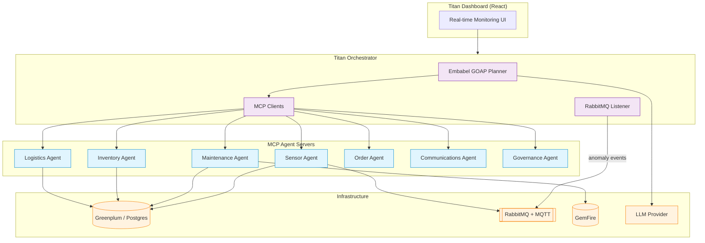
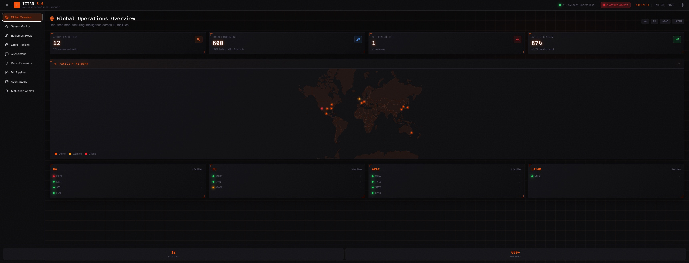
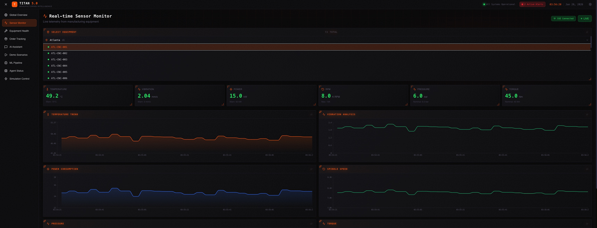

# Titan Manufacturing 5.0 — AI Platform


A multi-agent AI platform for manufacturing operations built with [Embabel](https://embabel.com), [Spring AI](https://docs.spring.io/spring-ai/reference/), and the [Model Context Protocol (MCP)](https://modelcontextprotocol.io). Titan Manufacturing simulates a global manufacturing company operating 600+ CNC machines across 12 facilities, demonstrating how autonomous AI agents coordinate to handle predictive maintenance, inventory management, logistics, and customer communications.


---

## Table of Contents

- [Architecture](#architecture)
- [Project Structure](#project-structure)
- [Key Demo Scenario — The Phoenix Incident](#key-demo-scenario--the-phoenix-incident)
- [Prerequisites](#prerequisites)
- [Quick Start (Docker Compose)](#quick-start-docker-compose)
- [Cloud Foundry Deployment](#cloud-foundry-deployment)
- [Environment Variables](#environment-variables)
- [MCP Agent Reference](#mcp-agent-reference)
- [Technology Stack](#technology-stack)
- [License](#license)

---

## Architecture

The platform uses a hub-and-spoke architecture. The **Titan Orchestrator** coordinates multiple specialized **MCP Agent Servers**, each exposing domain-specific tools via the Streamable HTTP transport. The orchestrator uses Embabel's Goal-Oriented Action Planning (GOAP) to dynamically compose multi-step agent chains at runtime.


```mermaid
flowchart TB
    subgraph Dashboard["Titan Dashboard (React)"]
        UI[Real-time Monitoring UI]
    end

    subgraph Orchestrator["Titan Orchestrator"]
        EP[Embabel GOAP Planner]
        MCP_C[MCP Clients]
        RL[RabbitMQ Listener]
    end

    subgraph Agents["MCP Agent Servers"]
        SA[Sensor Agent]
        MA[Maintenance Agent]
        IA[Inventory Agent]
        LA[Logistics Agent]
        OA[Order Agent]
        CA[Communications Agent]
        GA[Governance Agent]
    end

    subgraph Infra["Infrastructure"]
        GP[(Greenplum / Postgres)]
        RMQ[[RabbitMQ + MQTT]]
        GF[(GemFire)]
        LLM[LLM Provider]
    end

    UI --> Orchestrator
    RL --> |anomaly events| RMQ
    EP --> MCP_C
    MCP_C --> SA & MA & IA & LA & OA & CA & GA

    SA --> GP & RMQ
    MA --> GP & GF
    IA --> GP
    LA --> GP
    EP --> LLM

    classDef agent fill:#e1f5fe,stroke:#0288d1
    classDef infra fill:#fff3e0,stroke:#f57c00
    classDef orch fill:#f3e5f5,stroke:#7b1fa2

    class SA,MA,IA,LA,OA,CA,GA agent
    class GP,RMQ,GF,LLM infra
    class EP,MCP_C,RL orch
```

### How Embabel GOAP Works

Unlike fixed workflow engines, Embabel uses an A\*-based planner that discovers action sequences automatically. You define:

1. **A goal** (e.g., "respond to a critical anomaly")
2. **Available actions** with typed inputs/outputs
3. **Branch points** for conditional logic

The planner composes a chain at runtime — diagnosing the fault, checking inventory for replacement parts, scheduling logistics, and drafting customer communications — all without hard-coded orchestration steps. See [docs/embabel-architecture.md](docs/embabel-architecture.md) for details.

---

## Project Structure

```
titan-manufacturing/
├── titan-orchestrator/           # AI agent coordinator (Embabel + Spring AI)
├── sensor-mcp-server/            # IoT sensor monitoring — 600+ CNC machines
├── maintenance-mcp-server/       # Predictive maintenance & ML scoring
├── inventory-mcp-server/         # 50,000+ SKUs with pgvector semantic search
├── logistics-mcp-server/         # Global shipping (FedEx, UPS, DHL, Maersk)
├── order-mcp-server/             # Order validation & fulfillment
├── communications-mcp-server/    # Customer notifications & RAG-powered inquiries
├── governance-mcp-server/        # Data lineage & compliance (OpenMetadata)
├── sensor-data-generator/        # Simulated IoT telemetry stream
├── gemfire-scoring-function/     # Server-side PMML scoring in GemFire
├── titan-dashboard/              # React + Vite + Tailwind monitoring UI
├── cf-manifests/                 # Cloud Foundry deployment assets
├── config/                       # Infrastructure configs (GemFire, RabbitMQ, Greenplum)
├── docs/                         # Architecture docs, data matrices, audit checklists
├── docker-compose.yml            # Full local development stack
└── pom.xml                       # Maven multi-module parent
```

---

## Key Demo Scenario — The Phoenix Incident

The flagship demo shows a **critical anomaly on CNC machine PHX-CNC-007** at the Phoenix facility with a 73% predicted failure probability. When the anomaly fires via RabbitMQ, the Embabel GOAP planner autonomously:

1. **Diagnoses** the fault via the Maintenance Agent (vibration FFT analysis, bearing wear detection)
2. **Assesses urgency** — decides between immediate shutdown or deferred maintenance
3. **Checks parts** via the Inventory Agent (finds bearing replacement SKU, checks stock across facilities)
4. **Arranges logistics** via the Logistics Agent (expedited shipping from nearest stocked warehouse)
5. **Drafts customer communications** via the Communications Agent (delay notifications to affected orders)
6. **Validates compliance** via the Governance Agent (regulatory audit trail for FAA/ISO)

Each step is a separate MCP tool call to an independent microservice — the planner decides the sequence dynamically based on branch conditions.

---

## Prerequisites

| Tool | Version | Purpose |
|------|---------|---------|
| Java | 21+ | All backend services |
| Maven | 3.9+ | Build system |
| Node.js | 18+ | Dashboard build |
| Docker & Compose | Latest | Local infrastructure |

**LLM Provider** — at least one of:
- [Ollama](https://ollama.ai) running locally (default, free)
- OpenAI API key
- Anthropic API key

---

## Quick Start (Docker Compose)

```bash
# 1. Clone
git clone https://github.com/dbbaskette/titan-manufacturing.git
cd titan-manufacturing

# 2. Configure
cp .env.example .env
# Edit .env — set API keys if using OpenAI/Anthropic, or leave defaults for Ollama

# 3. Build
mvn clean package -DskipTests
cd titan-dashboard && npm install && npm run build && cd ..

# 4. Start infrastructure
docker compose up -d greenplum rabbitmq

# 5. Start all services
docker compose up -d
```

The dashboard is available at **http://localhost:5173**. The orchestrator API is at **http://localhost:8080**.

### Docker Compose Profiles

```bash
# Infrastructure only (Greenplum, RabbitMQ, GemFire)
docker compose --profile infra up -d

# All agents + orchestrator
docker compose up -d

# Monitoring stack (Prometheus, Grafana)
docker compose --profile monitoring up -d
```

---

## Cloud Foundry Deployment

The platform deploys to Tanzu Application Service (Cloud Foundry) with managed services replacing local Docker containers.

### Platform Services Required

| CF Service | Instance Name | Plan | Replaces (Docker) |
|------------|--------------|------|--------------------|
| `genai` | `titan-ai` | `tanzu-gpt-oss-120b-v1025` | Local Ollama / OpenAI |
| `p.rabbitmq` | `titan-rabbitmq` | `on-demand-plan` | Docker RabbitMQ |
| `p-cloudcache` | `titan-gemfire` | `extra-small` | Docker GemFire |
| `postgres` | `titan-pg` | `on-demand-postgres-db` | Docker Greenplum |

### One-Command Deploy

```bash
# Ensure you are logged into CF
cf login -a api.your-foundation.com

# Run the full pipeline (creates services, builds, pushes, configures networking)
./cf-manifests/deploy.sh
```

The deploy script:
1. Targets org/space and auto-detects the apps domain
2. Creates all platform service instances (idempotent)
3. Waits for async service provisioning
4. Builds all Java modules and the React dashboard
5. Pushes MCP agents first, then applies container-to-container network policies, then pushes the orchestrator
6. Verifies health endpoints

### Skip Flags

```bash
./cf-manifests/deploy.sh --skip-services   # Services already exist
./cf-manifests/deploy.sh --skip-build      # Artifacts already built
./cf-manifests/deploy.sh --skip-services --skip-build  # Redeploy only
```

### Manual Deploy

```bash
# 1. Create services
./cf-manifests/create-services.sh

# 2. Build
mvn clean package -DskipTests
cd titan-dashboard && npm install && npm run build && cd ..

# 3. Push
cf push -f cf-manifests/manifest.yml --vars-file cf-manifests/vars.yml

# 4. Network policies (orchestrator → agents on internal routes)
cf add-network-policy titan-orchestrator titan-sensor-agent --port 8080 --protocol tcp
cf add-network-policy titan-orchestrator titan-maintenance-agent --port 8080 --protocol tcp
cf add-network-policy titan-orchestrator titan-inventory-agent --port 8080 --protocol tcp
cf add-network-policy titan-orchestrator titan-logistics-agent --port 8080 --protocol tcp
```

### Cloud Profile

All Java applications activate the `cloud` Spring profile on CF (`SPRING_PROFILES_ACTIVE=cloud`). The `application-cloud.yml` files in each module read credentials from `VCAP_SERVICES` at runtime — no secrets in manifests or config files. The [java-cfenv](https://github.com/pivotal-cf/java-cfenv) library auto-wires datasource and AI service bindings.

See [cf-manifests/SERVICES.md](cf-manifests/SERVICES.md) for detailed service configuration.

---

## Environment Variables

Copy `.env.example` to `.env` and configure:

| Variable | Default | Description |
|----------|---------|-------------|
| `OPENAI_API_KEY` | `sk-...` | OpenAI or Ollama API key |
| `OPENAI_BASE_URL` | `http://host.docker.internal:11434` | LLM endpoint (Ollama default) |
| `OPENAI_MODEL` | `llama3.1:8b` | Chat model name |
| `DEFAULT_LLM` | `gpt-4.1` | Embabel default model alias |
| `ANTHROPIC_API_KEY` | — | Anthropic key (optional) |
| `GREENPLUM_USER` | `gpadmin` | Database user |
| `GREENPLUM_PASSWORD` | — | Database password |
| `RABBITMQ_USER` | `titan` | RabbitMQ user |
| `RABBITMQ_PASSWORD` | — | RabbitMQ password |
| `ANOMALY_RATE` | `0.05` | Simulated anomaly frequency |
| `FACILITY_COUNT` | `12` | Number of simulated facilities |

See [.env.example](.env.example) for the full list.

---

## MCP Agent Reference

Each agent exposes tools via the Model Context Protocol over Streamable HTTP (`/mcp` endpoint).

| Agent | Port (Docker) | Key Tools |
|-------|--------------|-----------|
| **Sensor** | 8081 | `list_equipment`, `get_sensor_readings`, `detect_anomalies`, `get_facility_status` |
| **Maintenance** | 8082 | `predict_failure`, `estimate_rul`, `schedule_maintenance`, `get_equipment_status` |
| **Inventory** | 8083 | `check_stock`, `semantic_search_products`, `find_alternatives`, `calculate_reorder` |
| **Logistics** | 8084 | `select_carrier`, `create_shipment`, `track_shipment`, `estimate_shipping_cost` |
| **Order** | 8085 | `validate_order`, `lookup_contract_terms`, `initiate_fulfillment`, `get_order_status` |
| **Communications** | 8086 | `send_notification`, `handle_inquiry`, `draft_customer_update` |
| **Governance** | 8087 | `get_metadata`, `trace_lineage`, `check_quality`, `trace_batch`, `compliance_report` |

---

## Technology Stack

| Layer | Technology |
|-------|-----------|
| Agent Framework | [Embabel](https://embabel.com) 0.3.2 (GOAP planner by Rod Johnson) |
| AI / LLM | [Spring AI](https://spring.io/projects/spring-ai) 1.1.2 (OpenAI, Anthropic, Ollama) |
| Agent Protocol | [Model Context Protocol](https://modelcontextprotocol.io) (Streamable HTTP) |
| Backend | Spring Boot 3.4, Java 21 |
| Frontend | React 19, Vite, Tailwind CSS 4, Recharts |
| Database | Greenplum (pgvector) / Tanzu Postgres |
| Messaging | RabbitMQ (AMQP + MQTT) |
| In-Memory Cache | VMware Tanzu GemFire (PMML scoring) |
| AI Services (CF) | Tanzu AI Services (GenAI proxy) |
| Platform | Docker Compose (local) / Tanzu Application Service (production) |

---

## Screenshots

| Global Overview | Sensor Monitor |
|:-:|:-:|
|  |  |

---

## License

Distributed under the MIT License. See [LICENSE](LICENSE) for details.
